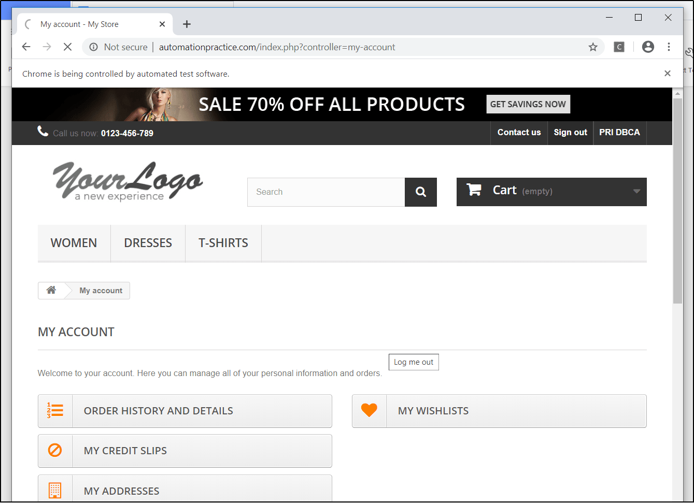

# AutomationTestingProject
* It is an Automation Testing project that will automate various tasks on a web application.
* The website link is this: http://automationpractice.com/index.php and we have automated different functionalism for the same.

### Softwares used:
* Eclipse as the IDE.
* TestNG.
* Selenium WebDriver.

### Technologies used:
* Java 8
* XML
* HTML

### Steps:
* Created a new project and included all the dependencies in the class path.
* Added various jar files required for Selenium and also added the library of TestNG inside the project and through that test-output folder gets created inside the project which has various important files.
* Also converted the project into TestNG and after that testng.xml file gets created.
* After that, Java class was created that contains all the automation and test scripts.
* Test cases were created for the following:
    * Registration form, Login, search bar, and add-to-cart functional-ties.
    * Also, handled invalid logins and showed appropriate error messages in the console for the same.
    * Fetched the test reports over HTML which automatically gets created when we inside the test-output folder as soon as we run the class with TestNG in the form of emailable-report.html.
* At the end, ran the MyStore.java with TestNG and the automation starts to happen on a new Chrome tab, since we have used ChromeDriver as WebDriver.

### Screen Captures:

#### Frontpage: Sign in button click functionality automation
<kbd></kbd>

#### Registration of email id functionality automation
<kbd></kbd>

#### Automatically Entered details for registration: part 1
<kbd></kbd>

#### Automatically Entered details for registration: part 2
<kbd></kbd>

#### Logging in with email ID functionality automation
<kbd></kbd>

#### Logged In
<kbd></kbd>

#### Console message for valid login
<kbd></kbd>

#### Invalid Login
<kbd></kbd>

#### Console message for invalid login
<kbd></kbd>

#### Search Functionality automation
<kbd></kbd>

#### Add to cart Functionality automation
<kbd></kbd>

#### Generated Test Report
<kbd></kbd>

